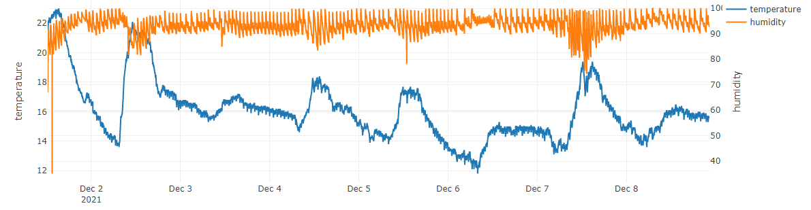

# dhtviz
Visualize environmental data reported from dhtlog and stored in Postgres database.

This repository is used to create a continuously-updated dash app accessible via browser. It visualizes the temperature and humidity data recorded using [dhtlog](https://github.com/tomhata/dhtlog).



I run this script on a headless computer running Ubunutu on my home network, assigned to a static IP. This computer is also hosting the Postgres database containing the environmental data. I access the dashboard using other computers on the home network via browser.

Note: This is one-off code for a pet project without much out-of-the box configurability.

# Setup
* Clone `dhtviz` repository to home directory
* Create a `.env` file in the top level of the cloned repository with the following fields and format (This can be reused from [dhtlog](https://github.com/tomhata/dhtlog). INTERVAL variable is not used and therefore omitted here.):
    ```
    # Configuration for dhtlog
    SQL_HOST=1.1.1.1 # Host IP address
    SQL_PORT=5432 # Default Postgres port is 5432
    SQL_USER=user
    SQL_PASSWORD=password
    SQL_DATABASE=database
    SQL_TABLE=table
    ```
    The path should resemble `/home/user/dhtviz/.env`

    **IMPORTANT** If you want the script to run automatically on boot via crontab (see below), open `./dhtviz/dhasboard.py` and change the line `load_dotenv(".env")` to `load_dotenv("/absolute/path/to/.env")`

* Open default port for dash
    ```
    # open firewall ports
    sudo apt install firewalld
    
    # open port 8050 (default dash port)
    sudo firewall-cmd --zone=public --add-port=8050/tcp --permanent success

    # reload firewall
    sudo firewall-cmd --reload
    ```
* Set script to run on boot by doing the following:
  * Open crontab by running `crontab -e` in terminal
  * At the bottom of the file, add line
    ```
    @reboot sleep 60 && python3 /home/tom/dhtviz/dhtviz/dashboard.py
    ```
* [Optional] Check device IP address with command `ip a`
* Reboot system `sudo reboot now`

# Accessing
* On a different computer, you should be able to access the dashboard by entering opening a browser window and entering (above IP address):8050

# Potential Todos
* Maintain current view on refresh
* Enter specific date ranges
* Custom time binning